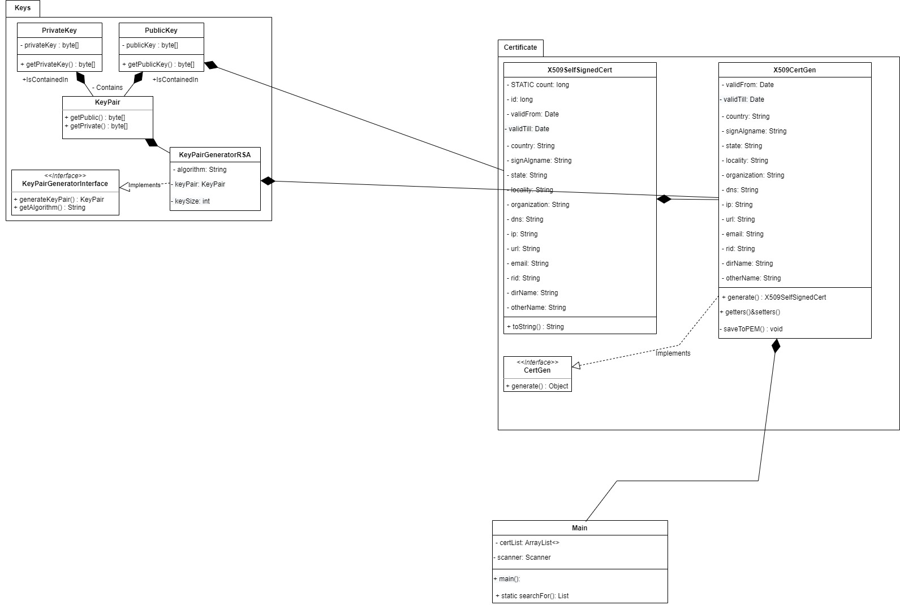

# CertGen

This is a Java Certificate Generator tool.  

It is supposed to ease the pain of storing and creating certificates using Java,  
because right now this may be a little of a hassle.

It is easy to store and manage certificates using Java keystore tool, but this one helps
in the process of creation for a user unskilled in programming.

## Use

Run the program and choose one of the following options depending on your needs:
1 - Create a new cert and add it to the list
2 - Show the actual list
3 - Search for certificates
4 - Delete certificate with ID
5 - Exit program

The program will save and delete new .pem files in the project root folder!

## TODO
1) Migrate to Java FX

## UML

docker build . -t certgen-docker1

docker run -p 8081:8081 certgen-docker1 -name certgen